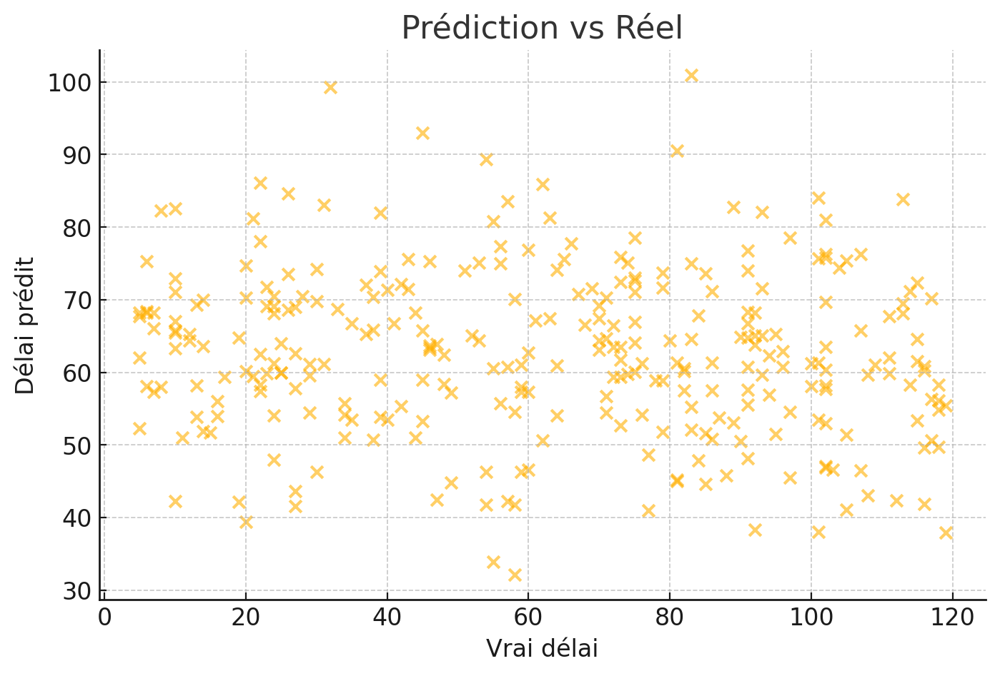

# 📊 Prédiction du Délai de Paiement & Analyse Comptable

Ce dépôt GitHub regroupe deux volets complémentaires autour de la **valorisation des données comptables** :

1. Un projet de **Machine Learning** visant à prédire le **délai de paiement des clients** à partir de fichiers FEC fictifs.
2. Un **extrait de dashboard Power BI** illustrant des analyses comptables issues de données consolidées.

---

## 🧠 Objectif global

> Montrer comment les données comptables peuvent être exploitées :
> - pour enrichir la compréhension des délais de paiement clients,
> - pour automatiser certaines analyses financières,
> - et pour produire des tableaux de bord utiles à la décision.

---

## 📁 Structure du dépôt

📂 `data/` : Vous retrouverez dans ce dossier mes projets ainsi que des extraits de mon travail (notebook Python, visualisations, images du dashboard, etc.).

---

## 🔬 1. Projet de prédiction du délai de paiement

Notebook principal : [`prediction_delai_paiement_fec.ipynb`](./data/prediction_delai_paiement_fec.ipynb)

Ce notebook Jupyter présente toutes les étapes de travail :

- **Simulation de fichiers FEC** avec colonnes : `EcritureDate`, `Montant`, `Débit`, `Crédit`, `ClientID`, `DatePaiementClient`, etc.
- **Préparation des données** et création de la cible :  
  ```python
  df['Delai'] = (df['DatePaiementClient'] - df['EcritureDate']).dt.days
  ```
- **Entraînement d’un RandomForestRegressor**
- **Évaluation du modèle** :
  - MAE : ~18 jours
  - RMSE : ~21 jours
  - R² : ~0.009 *(modèle de base, améliorable)*
- **Visualisation des résultats** :

  

---

## 📈 2. Aperçu d’un dashboard comptable (Power BI)

Ce projet comprend aussi un **extrait visuel d’un dashboard** Power BI réalisé dans le cadre de missions comptables réelles (données confidentielles non divulguées, visuel à but illustratif uniquement).

📌 Exemple de visualisation incluse :
- Soldes clients/fournisseurs
- Indicateurs de gestion
- Analyse par journaux ou périodes


---

## ⚙️ Technologies utilisées

- Python (pandas, sklearn, matplotlib, seaborn)
- Jupyter Notebook
- Power BI
- Données FEC simulées

---

## 💡 Pistes d’amélioration

- Ajouter des données client (type, ancienneté, pays…)
- Exploiter les `Libellés` avec NLP
- Intégrer des cycles temporels
- Tester d’autres modèles : XGBoost, CatBoost...

---

## 👤 À propos

**Kevin Boucetta**  
🎓 Data Analyst en alternance chez Fidaco (cabinet d’audit)  
📍 Basé à Angers (France)   
🔗 [LinkedIn](https://linkedin.com/in/kevinboucetta)

---

⭐ N'hésitez pas à laisser une étoile ⭐ si le projet vous a plu, ou à me contacter pour échanger !
